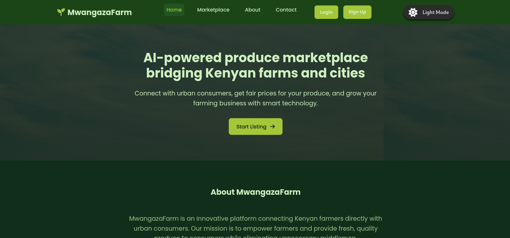

# 🌿 MwangazaFarm


[](LICENSE)

---

**MwangazaFarm** is a dynamic web platform that connects local Kenyan farmers with urban consumers by leveraging AI-generated produce listings. This platform empowers farmers to showcase fresh, high-quality produce online through smart, appealing descriptions — effectively bridging the rural-urban market gap.



---

## ✨ Key Features

- 🌱 **Clean, Green-Themed Design**  
  Embraces an organic and eco-friendly aesthetic reflecting the spirit of agriculture and sustainability

- 🤖 **Smart AI Listing Generator**  
  Automatically crafts produce details: name, quantity, location, price, and category for farmers

- 👁️ **Real-Time Listing Preview**  
  Farmers can view their AI-generated produce listings live before publishing

- 🔐 **Firebase Integration**  
  Secure Firestore database for saving listings & Authentication for user accounts

- 📱 **Responsive Design**  
  Mobile-first layout including a collapsible menu, smooth scrolling, and user notifications

- 🔎 **Marketplace with Search & Filters**  
  Easy navigation to find produce by category, location, price range, and more

- 💬 **In-App Messaging System**  
  Connect farmers and consumers directly within the platform to discuss listings

- 🌗 **Theme Toggle**  
  Switch between light and dark modes with a simple toggle at the top

---

## 🛠️ Tech Stack

- **Frontend:**  
    
    
  

- **Backend:**  
    
  Firestore Database & Authentication

- **Advanced Features:**  
  - AI-powered smart listing generation  
  - Recommendation system for tailored produce suggestions  
  - Farmer dashboards for managing listings and analytics  
  - Mobile app version (in development)

---

## 🚀 Getting Started

### Prerequisites

- Node.js and npm installed (optional, for development server)
- A Firebase project with Firestore & Authentication enabled

### Installation & Running Locally

1. Clone the repo:

   ```bash
   git clone https://github.com/Lincoln-Madaraka/MwangazaFarm254.git
   cd MwangazaFarm254
2. Install dependencies
3. Run the development server;
Open the app in your browser at http://localhost:3000 or open index.html directly if no server is used.

🌍 Deployment
MwangazaFarm254 is deployed on Vercel for blazing-fast, scalable hosting.
Access the live demo here:
https://your-vercel-link.vercel.app (Replace with your actual URL)

📂 Project Structure
MwangazaFarm254/
├── public/
│   └── mwangazafarm.png         # App screenshot and static assets
├── index.html                   # Main app page
├── styles.css     
└── script.js
🤝 Contributing
Contributions, issues, and feature requests are welcome! Feel free to check issues page or submit a pull request.

👨‍💻 Author
Lincoln Madaraka
[](https://github.com/Lincoln-Madaraka)